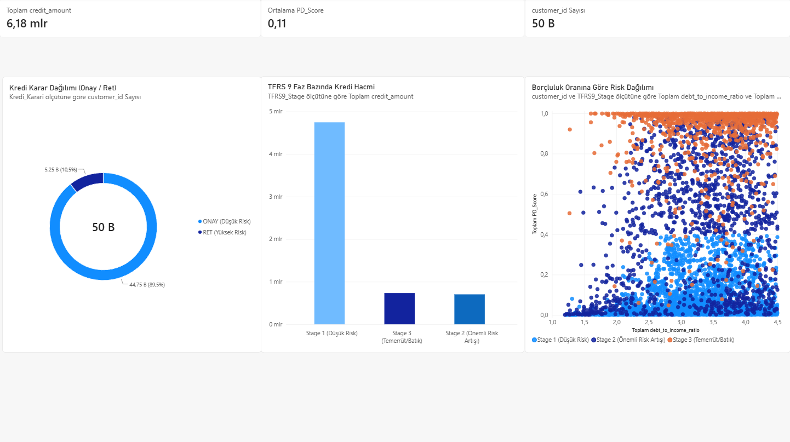
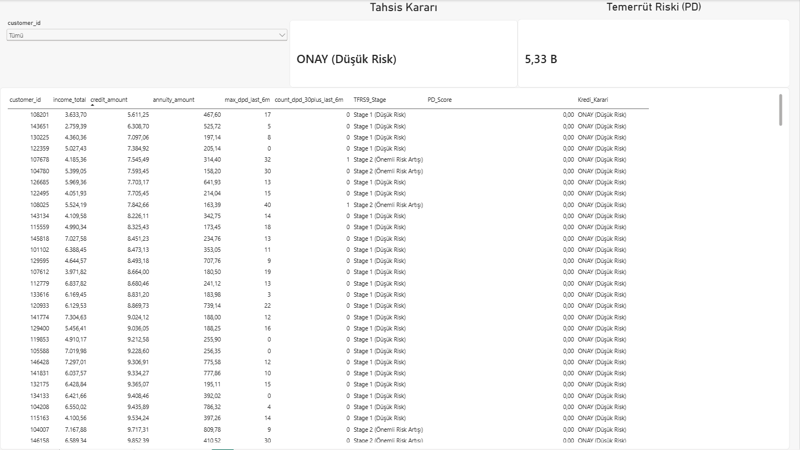

# Credit Risk Assessment & TFRS 9 Dashboard

An end-to-end interactive Power BI decision support system simulating credit risk modeling, Probability of Default (PD) scoring, and TFRS 9 (IFRS 9) stages across a retail loan portfolio of 50,000 customers.

---

## Business Objective & Overview

Managing Expected Credit Loss (ECL) and complying with TFRS 9 regulatory standards requires robust monitoring of portfolio health alongside dynamic underwriting tools. This project addresses both executive-level oversight and operational underwriting needs through a structured two-page analytical dashboard.

---

## Key Features & Architecture

### 1. Portfolio Risk Monitoring (Macro View)
* **TFRS 9 Stage Distribution:** Loan volumes categorized across Stage 1 (Performing), Stage 2 (Significant Increase in Credit Risk - SICR), and Stage 3 (Default/Impaired).
* **Portfolio Approval Breakdown:** Total retail loan volume split across automated approval and rejection buckets.
* **Risk Correlation Matrix:** Scatter analysis evaluating Debt-to-Income (DTI) ratio against PD scores segmented by impairment stages.

---

### 2. Underwriting & Individual Assessment (Micro View)
* **Customer Selection:** Dynamic search and single-select customer filtering mechanism.
* **Instant Decision Engine:** Real-time generation of underwriting decisions (`ONAY / RET`) based on customer risk thresholds.
* **Granular Metrics Table:** Direct visibility into customer income, loan volume, monthly annuity, DPD (Days Past Due), and regulatory staging.

---

## Data Dictionary & Metric Logic

* **TFRS 9 Stages:**
  * **Stage 1 (Low Risk):** Performing loans with low probability of default and minimal payment delays.
  * **Stage 2 (Significant Risk Increase):** Loans showing significant credit deterioration or 30+ DPD trends.
  * **Stage 3 (Default/Impaired):** Non-performing facilities exceeding regulatory default criteria.
* **PD Score:** Probability of Default metric predicting 12-month default likelihood.
* **Underwriting Decision Rule:** Rule-based decision output evaluating DTI, PD score, and DPD limits.

---

## Tech Stack

* **Tool:** Power BI Desktop
* **Language & Analysis:** DAX, Data Modeling, Credit Risk Segmentation
* **Design:** Corporate Financial Reporting & Visual Interaction Optimization
